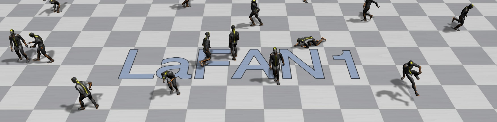
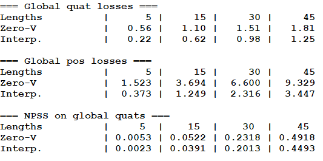
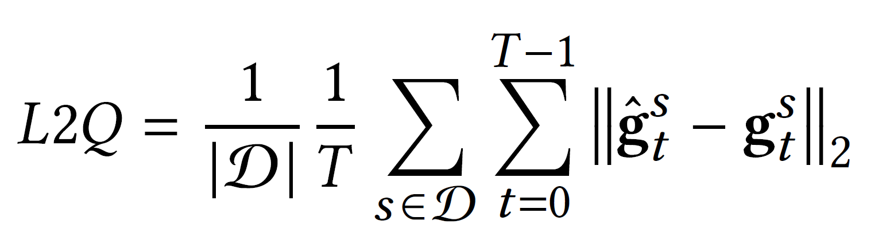
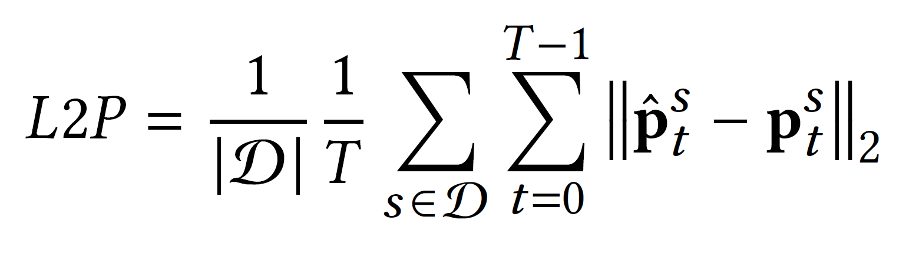

# LaFAN1

Ubisoft La Forge Animation dataset and accompanying code for the Robust In-Betweening SIGGRAPH 2020 article.  
Shot in May 2017.

## Data
The animation data is contained in the lafan1.zip file.  
All the animation sequences are in the BVH file format.  
There are 5 subjects in the dataset, 77 sequences, and 496,672 motion frames at 30fps (~4.6 hours).  
Every BVH file is named with the folowwing convention: \[*theme*\]\[*take number*\]_\[*subject ID*\].bvh.  
Any sequences sharing the same *theme* and *take_number* were recorded at the same time in the studio.  
Themes are high level indicators of the actions in the sequences.

The following themes are present in the LaFAN1 dataset:

|   Theme         |  Description                                  |Number of sequences|
|:----------------|:------------------------------------------    |:-----------------:|
| Obstacles       |  Locomotion on uneven terrain                 |17                 |
| Walk            |  Walking locomotion, with different styles    |12                 |
| Dance           |  Free dancing                                 |8                  |
| Fall and get up |  Falling on the ground and getting back up    |6                  |
| Aiming          |  Locomotion while handling or aiming a gun    |5                  |
| Ground          |  Locomotion while crawling and crouching      |5                  |
| Multiple actions|  Miscellaneous/multiple movements per sequence|4                  |
| Run             |  Jogging/Running locomotion                   |4                  |
| Fight           |  Various fight movements                      |3                  |
| Jumps           |  Locomotion with one and two-leg jumps        |3                  |
| Fight and sports|  Fight and sports movements                   |2                  |
| Push and stumble|  Pushing, stumbling and recovery              |3                  |
| Push and fall   |  Pushing, falling, and getting up             |2                  |
| Sprint          |  Sprinting locomotion                         |2                  |
| Push            |  Pushing adversary                            |1                  |

## Code

### Requirements
You should only need `numpy` installed in a python 3.X environment, but the code was developped with `python 3.7` and `numpy 1.17.4`

You can easily create a test environement with `conda` : 

`conda create -n lafan_env python=3.7 numpy=1.17.4`

### Evaluating baselines
From the command line:

`python evaluate.py`

To validate that the results produced by the baseline evaluations are within the expected ranges, you can subsequently run:

`python evaluate_test.py`

---

The first run may take several minutes, as it will compute the training statistics.  
Following runs should go faster.

The training statistics for normalization are computed on windows of 50 frames offset by 20 frames.  
We sample our test windows from Subject 5 at every 40 frames, and retrieve 2232 sequences for evaluation.

In the **Zero-Velocity** baseline, the last seed frame is repeated during the whole transition.  
In the **Interpolation** baseline, the global root position is linearly interpolated (LERP), and quaternions are spherically linearly interpolated (SLERP).  

---

You should obtain the following results:

### Evaluation metrics
When running the baseline evaluations, we report three different metrics on global quaternions on positions to assess the quality of the generated transition.

#### Global quaternion loss
The global quaternion loss (L2Q) is the L2 distance computed between estimated and ground-truth global quaternion vectors ***g***, averaged over each time step *t* and over all sequences *s* in the test set. 

#### Global position loss
The global position loss (L2P) is the L2 distance computed between estimated and ground-truth normalized global position vectors ***p***, averaged over each time step *t* and over all sequences *s* in the test set.

#### Normalized Power Spectrum Similarity (NPSS) on global quaternions
This is a distance metric based on the power spectrum of joint angles, as proposed by Gopalakrishnan et al. (2019).  
It is reported to correlate better with human judgement about motion.  
Its motivation and implementation details can be found in [their paper][1].

[1]: <http://openaccess.thecvf.com/content_CVPR_2019/papers/Gopalakrishnan_A_Neural_Temporal_Model_for_Human_Motion_Prediction_CVPR_2019_paper.pdf> "A Neural Temporal Model for Human Motion Prediction"
